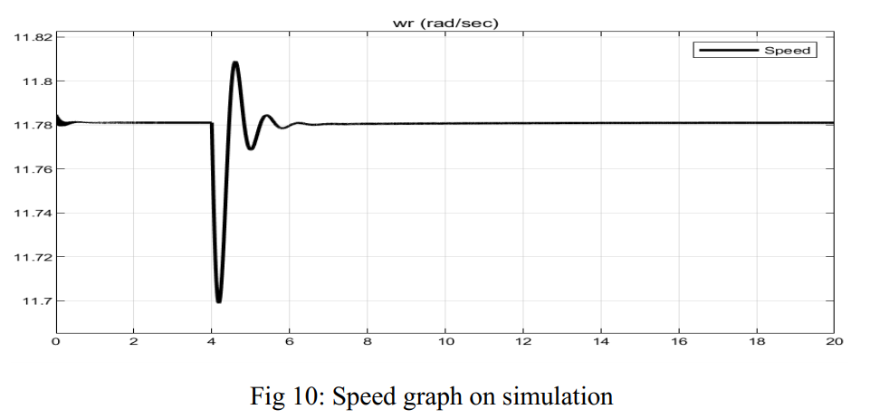

# Dynamic Modeling of Electric Machines

This repository contains two projects focused on the dynamic modeling of electric machines using MATLAB/Simulink:
1. **Synchronous Generator (Hydro Turbine)**  
2. **Separately-Excited DC Motor**  

## Overview
The projects demonstrate the implementation of dynamic models for both AC and DC machines, analyze transient and steady-state behaviors, and validate theoretical results against simulations. The simulations include responses to sudden torque changes, speed characteristics, and current profiles.

---

## Projects

### 1. Dynamic Modeling of a Synchronous Generator
#### Objective
- Implement a dynamic model of a 325 MVA hydro-turbine synchronous generator.
- Analyze performance during a sudden input torque change.

#### Specifications
- **Rating**: $$325 MVA$$  
- **Voltage**: $$20 kV$$ (line-to-line)  
- **Poles**: $$64$$ | **Speed**: $$112.5 rpm$$  
- **Inertia**: $$\( J = 35.1 \times 10^6 \, \text{J·s}^2 \)$$  
- **Key Parameters**:  
  $$\( r_s = 0.00234 \, \Omega \), \( X_d = 1.0467 \, \Omega \), \( X_q = 0.5911 \, \Omega \), \( H = 7.5 \, \text{s} \)$$  

#### Methodology
- Transform stator voltages to the rotor’s q-d reference frame.
- Solve flux linkage and current differential equations.
- Compute electromagnetic torque, rotor speed, and torque angle.

#### Key Results
- **Rotor Speed**: Matched theoretical value of $$11.78 rad/s (112.5 rpm)$$.  
- **Torque Angle**: Simulated $$\( \delta = 16^\circ \) vs. theoretical \( 18^\circ \)$$.  
- **Electromagnetic Torque**: Simulated $$\( 27.6 \times 10^6 \, \text{N·m} \) (vs. theoretical \( 23.4 \times 10^6 \, \text{N·m} \))$$.  

---

### 2. Dynamic Modeling of a Separately-Excited DC Motor
#### Objective
- Model a DC motor with load torque variations.
- Analyze speed and current responses during no-load and loaded conditions.

#### Specifications
- **Armature**: $$\( R_a = 0.5 \, \Omega \), \( L_a = 0.003 \, \text{H} \)$$  
- **Back EMF**: $$\( K_e = 0.8 \, \text{V/rad/s} \)$$  
- **Load**: $$\( J = 0.0167 \, \text{kg·m}^2 \), \( B_1 = 0.01 \, \text{N·m/rad/s} \)$$  
- **Supply Voltage**: $$220 V DC$$  

#### Methodology
- Solve differential equations for armature current and mechanical speed:
  \[
  $$\frac{di_a}{dt} = \frac{1}{L_a} (V_{in} - K_e \omega_m - R_a i_a)$$
  \]
  \[
  $$\frac{d\omega_m}{dt} = \frac{1}{J} (K_t i_a - T_L - B_1 \omega_m)$$
  \]

#### Key Results
- **No-Load Startup**: Speed reaches steady state with zero armature current.  
- **100 N·m Load**: Steady-state current increases to balance torque.  
- **Transient Overshoot**: Observed in armature current during startup.  

---

## Simulation Results
### Synchronous Generator
| Figure | Description |
|--------|-------------|
|  | Speed stabilizes at 11.78 rad/s. |
| Fig 18 | Torque angle settles at -16° (generating mode). |
| Fig 19 | Electromagnetic torque oscillates before stabilizing. |

### DC Motor
| Figure | Description |
|--------|-------------|
| Fig 2  | No-load speed rises exponentially to 275 rad/s. |
| Fig 3  | Loaded speed stabilizes at 150 rad/s. |
| Fig 5  | Armature current peaks at 250 A during loaded startup. |

---

## Getting Started
### Prerequisites
- MATLAB R2021a or later.
- Simulink and Simscape Electrical (for machine modeling).
